# To Be Ahead 

**To Be Ahead** is the website that give some thoughts what you need to prepare for a home crisis, what you can have in you everyday carry-bag (EDC) and what to have in a bag if you have to leav your home, bug out bag (BOB).

If you whant to know more you can sign up to a weeks cours in one of three intresst.

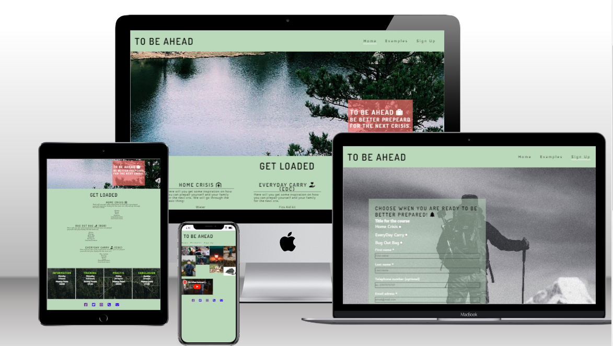

## Featurs

### Navigation
- The header shows the name of the page, up to the left. And the menu is to the rigt.
- The menu contains links to the Home, Examples and Sign Up pages and will be all responsive.

### Footer
- The footer will contain icons whit links to media websites and icons to contact us by mail or phonecall.

### Favicon
- A icon to show curiosity is added to the page Title.
- This will allow the user to easily identify the website if they have multiple tabs open.

### 404 Page
- A 404 Page is implemented if a user nagigates to a broken link. In that page will there be a link back to the home page.

### Home page
- An effectfull first picture that will zoom in a little bit.
- You will get a short presentation what this site is about.
- you will get a short summation on what the three courses is about.

### Examples
- A portfolio whit images of things we will touch through the course.
- Little movie from the swedish goverment about home crisis.

### Sign Up
- Choose between one of three courses to join. 
    - First Name (required)
    - Last Name (required)
    - Phone number (optional)
    - Email adress (required)

- On successfull submission of the contact form, the user will navigated to the "Thank you" page and a tabel whit the scheduel.

### Existing Features
- Responsive design
- Sign Up page whit a responsive form and whit a "Thank you" page.
- 404 -site
- Gallery whit a resoponsive images.
- Three nice courses to choose between and a scheduel for all of them.

## Design

### First layot
- Used paper and pencil to draw the big layout of the homepage
- Used paper and pencil to find out where to put Heading and site navigation.

## Technologies
- HTML
    - The structure of the Website was developed using HTML as the main language.
- CSS
    - The Website was styled using custom CSS in an external file.
- GitHub
    - Source code is hosted on GitHub and delpoyed using Git Pages.
- Git
    - Used to commit and push code during the development opf the Website
- Font Awesome
    - Icons obtained from https://fontawesome.com/ were used as the Social media links in the footer section.
- Tinyjpg
    - https://tinyjpg.com/ was used to reduce the size of the images used throughout the website
- Favicon.io
    - favicon files were created at https://favicon.io/favicon-converter/

## Testing

### Resonsiveness
All pages were tested to ensure responsiveness on screen sizes from 375px and upwards. Tested on different browsers: Chrome, Edge, Firefox and Opera.

Steps to test:

1. Open browser and navigate to To Be Ahead
2. Open the developer tools (right click and inspect)
3. Set to responsive and decrease width to 320px
4. Set the zoom to 50%
5. Click and drag the responsive window to maximum width

Expected:

Website is responsive on all screen sizes and no images are pixelated or stretched. No horizontal scroll is present. No elements overlap

- I tested the responsivity for different devices, from desktop page, tablet size, down to mobile device size of the page.
- I tested this site in different browser to check it works. Chorme, Firefox, Opera, Microsoft Edge.
- I tested so the navigation, menu, gallery and sign up form is readable in different screens.
- I have tested and confrim that the form works: required the * fileds and only accept a correct email address for the submit button work. The reset button works also.

## Functional Testing

### Navigation Links
 - index.html OK
 - gallery.html OK
 - signup.html OK
 - thankyou.html OK
 
 ### form
 The form responds. Get you a messege when everyhing is in. Required is working and email field.

## Deployment

### Version Control
The site was created using the Visual Studio code editor and pushed to github to the remote repository ‘to-be-ahead’.

The following git commands were used throughout development to push code to the remote repo:

`git add .` - This command was used to add the file(s) to the staging area before they are committed.

` git commit -m “commit message”` - This command was used to commit changes to the local repository queue ready for the final step.

`git push` - This command was used to push all committed code to the remote repository on github.

### Deployment to Github Pages
- The site was deployed to GitHub pages. The steps to deploy are as follows:
    - In the GitHub repository, navigate to the Settings tab
    - From the menu on left select 'Pages'
    - From the source section drop-down menu, select the Branch: main
    - Click 'Save'
    - A live link will be displayed in a green banner when published successfully.

The live link can be found here - https://groundbuilder.github.io/to-be-ahead/

### Clone the Repository Code Locally
Navigate to the GitHub Repository you want to clone to use locally:

Click on the code drop down button
- Click on HTTPS
- Copy the repository link to the clipboard
- Open your IDE of choice (git must be installed for the next steps)
- Type git clone copied-git-url into the IDE terminal

The project will now of been cloned on your local machine for use.

## Bugs
- Big bug was the responsive image at the homepage. It was broken, and then I saw the funktion in it was also broken.
- the video took up to much space, and it didn't fit for mobile devices. 
- The error that occors in in W3C validation, had no more time to fix it. Saw it to late.

## Validator Testing
- HTML
    - Error were returned for the <iform> when passing through the official W3C valiator. 
    For the Index
    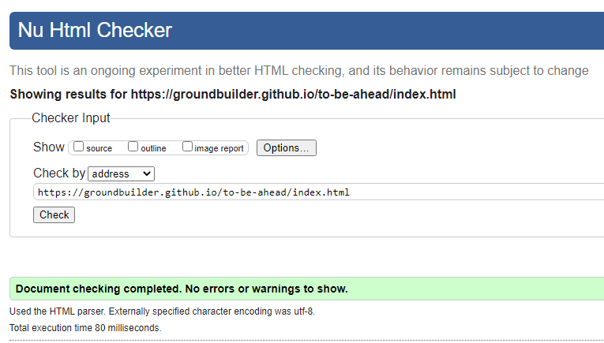
    For the Gallary
    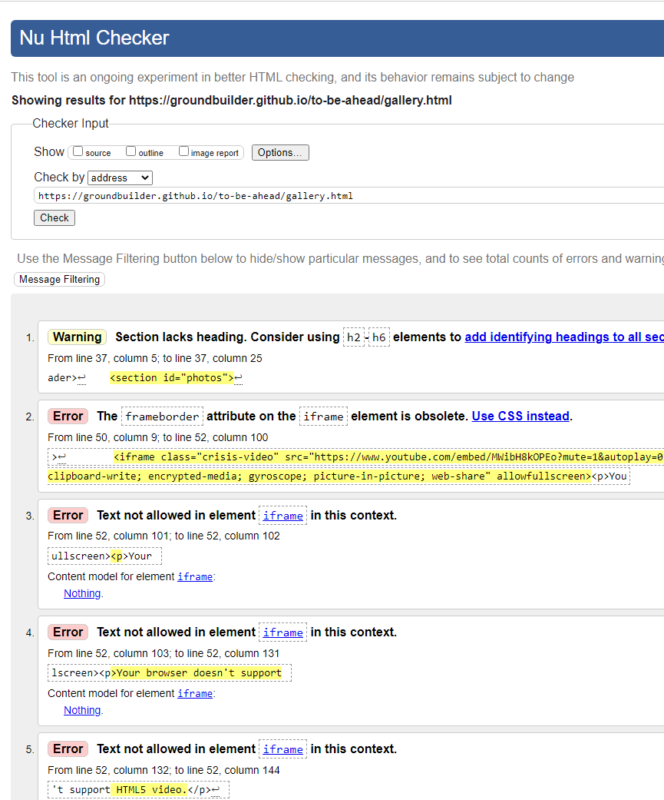
    For the Sign Up
    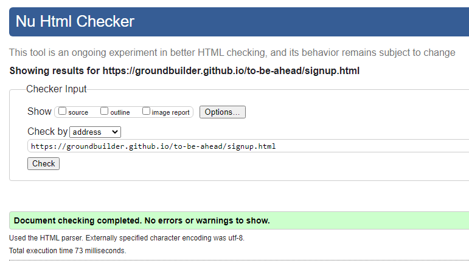
    For the Thank You
    
- CSS
    - No errors were returne when passing through the official (Jigsaw) validator
    
    For the Index
    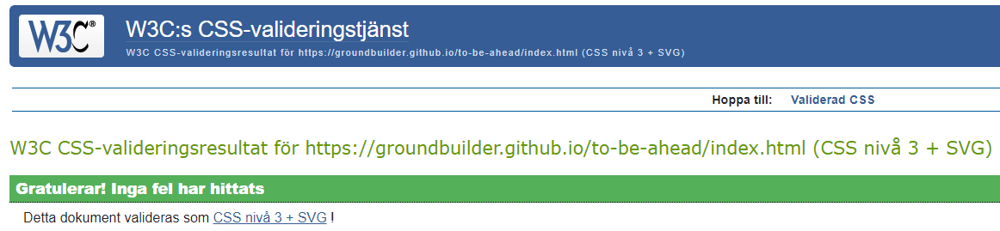
    For the Gallary
    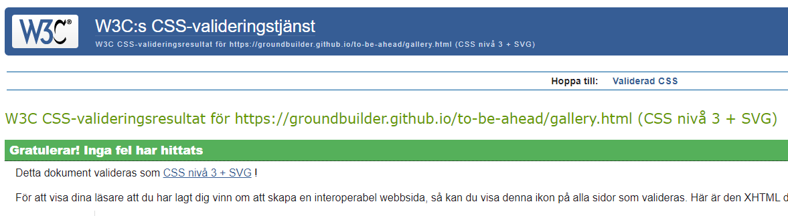
    For the Sign Up
    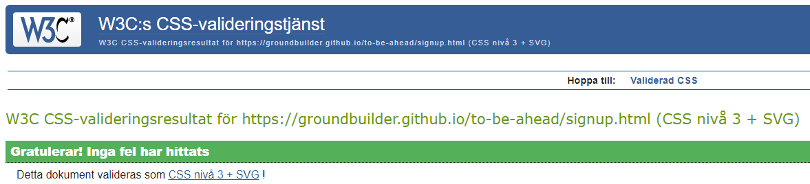
    For the Thank You
    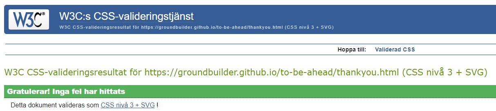
    For the CSS-code
    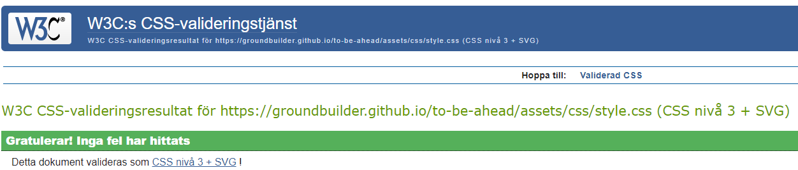

- Accessibility
    - I confirmed that the colors and fonts chosen are easy to read and accessible by running it thorugh lighthouse in devtools. Big images took it down.
    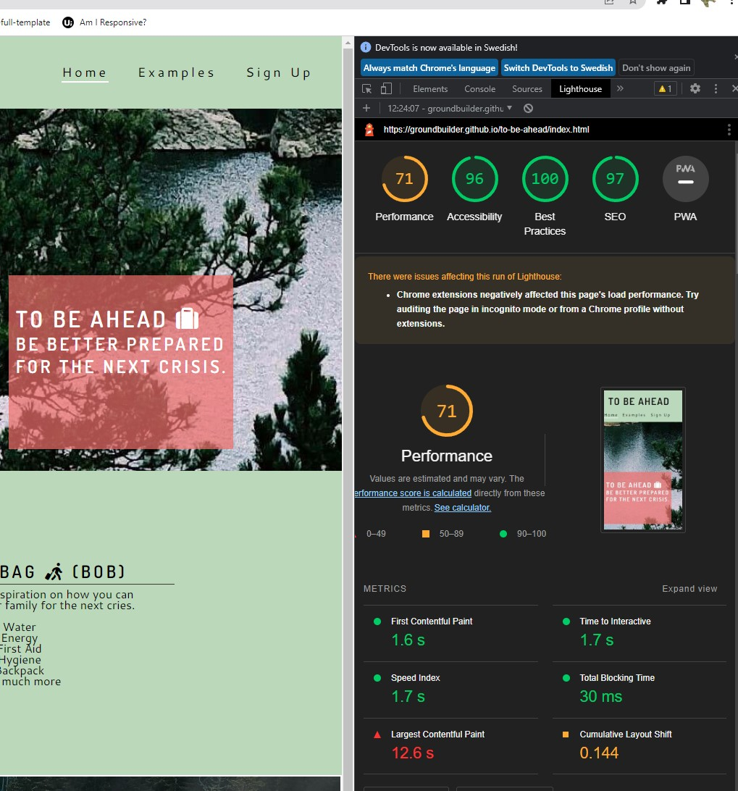
    - Conrast was good. Only one Error, but if I fix it here it will be a error in HTML-validation. https://wave.webaim.org/
    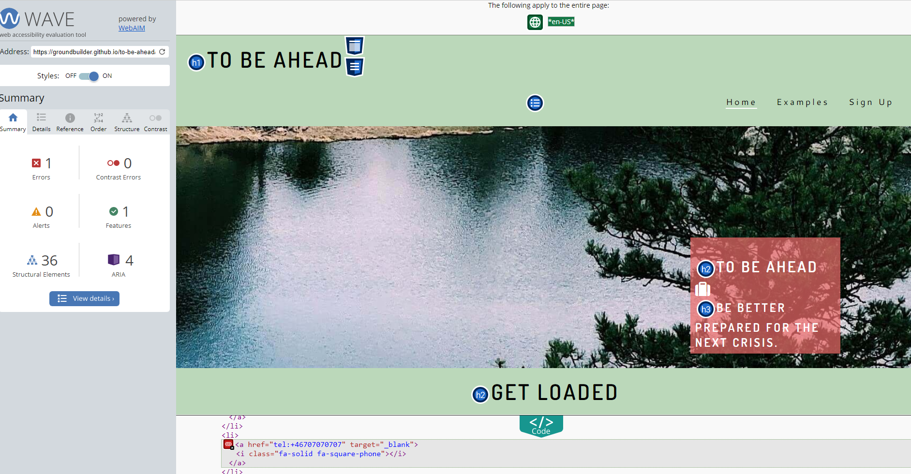

## Credits

### Content
- The code for the zooming image was taken from the CI "Love Running project"
- [W3school](https://www.w3schools.com/) find how to fix video appear better on screen. How to fix mute to movie.
- [Favicon](http://favicon.io/) To make icon wo browser-tab.

### Media
- All the images in the site was taken from [Pexels](http://www.pexels.com)

